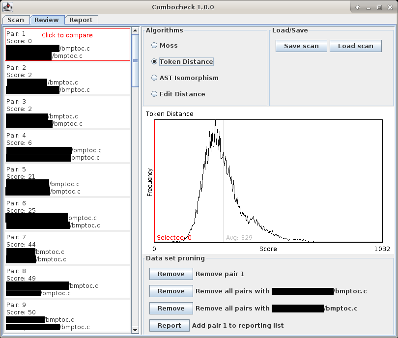

# Combocheck
This is cheat detection software which I wrote (and used as a teaching assistant) for my master's project at Georgia Tech. It is used to:
- Compare a set of submissions for programming assignments against one another
- View which parts of the most similar submission pairs are the same
- Prune pairs deemed not to be in violation of code of conduct
- Select and annotate submission pairs for reporting to the teacher
- Export annotations as HTML files per submission pair

The supported programming languages are C and Java, but any type of submission (even text) can be scanned. The additional features for supported languages are the token edit distance algorithm (which tends to be the most accurate metric available in combocheck) and whitespace removal in the comparison.

The supported comparison algorithms are implemented both in Java, and in C++ as a shared library (compiled for 64-bit linux). Usage of the algorithm library is much faster, so it is recommended to perform these scans on a linux machine if you are able to.

See [the documentation](bin/Combocheck.pdf) for more details.

## Submission comparison view

## Pair histrogram view

## Submission reporting view

## Exported HTML report example

